# Watch Price Forecasting API

A cloud-native luxury watch price prediction system deployed on Google Cloud Platform. This project demonstrates a complete ML pipeline transformation from local development to production-ready cloud services, featuring real-time price forecasting for premium watch brands like Patek Philippe through a REST API and interactive web interface.

🌐 **Live API**: [Interactive API Documentation](https://timepiece-api-zmlm4rlafq-uc.a.run.app/docs)

## 🏗️ High-Level Architecture

```mermaid
graph TB
    User[👤 User] --> Streamlit[📊 Streamlit App<br/>Streamlit Cloud]
    User --> API[🔗 Direct API Access]

    Streamlit --> CloudRun[☁️ Cloud Run Service<br/>FastAPI Application]
    API --> CloudRun

    CloudRun --> CloudStorage[🗄️ Cloud Storage<br/>ML Models & Data]
    CloudRun --> CloudLogging[📋 Cloud Logging<br/>Structured Logs]

    CloudBuild[🔄 Cloud Build<br/>CI/CD Pipeline] --> CloudRun
    CloudBuild --> CloudFunction[⚡ Cloud Function<br/>Serverless Endpoint]

    CloudMonitoring[📈 Cloud Monitoring<br/>Alerts & Metrics] --> CloudRun

    GitHub[📁 GitHub Repository] --> CloudBuild
```



This project showcases a modern cloud-first ML deployment on Google Cloud Platform with:

- **🔮 REST API**: Cloud Run service providing real-time price predictions
- **⚡ Serverless Functions**: Cloud Functions for external integrations
- **☁️ Model Storage**: Cloud Storage for ML model artifacts (42 models, 92MB)
- **📊 Interactive Dashboard**: Streamlit app with cloud backend integration
- **🔍 Monitoring**: Cloud Logging, alerting, and performance monitoring
- **🔄 CI/CD**: Automated deployments via Cloud Build

### Live API Endpoints

**Base URL**: `https://timepiece-api-zmlm4rlafq-uc.a.run.app`

```bash
# Get available watches
curl https://timepiece-api-zmlm4rlafq-uc.a.run.app/watches

# Get available models
curl https://timepiece-api-zmlm4rlafq-uc.a.run.app/models

# Make a prediction (D1-D7 forecasting)
curl -X POST https://timepiece-api-zmlm4rlafq-uc.a.run.app/predict \
  -H "Content-Type: application/json" \
  -d '{"watch_id": "Philippe_Nautilus_5711_Stainless_Steel_5711_1A", "model_name": "lightgbm", "horizon": 7}'
```

## 🎯 Key Features

### **D1-D7 Price Forecasting**
- Real-time predictions for 1-7 day horizons
- Multiple ML models: LightGBM, XGBoost, Ridge, Random Forest, Linear
- 5 premium Patek Philippe watch models supported

### **Production-Ready Infrastructure**
- **Auto-scaling**: Cloud Run handles traffic spikes automatically
- **Monitoring**: Real-time latency and error rate alerts
- **Logging**: Structured logging with Cloud Logging integration
- **CI/CD**: Automated testing and deployment pipeline

### **Developer-Friendly API**
- RESTful endpoints with OpenAPI documentation
- Batch prediction support for multiple watches
- Error handling and validation
- CORS enabled for web integrations

## 🌐 Cloud Deployment Guide

### Quick Deploy
```bash
# Clone and deploy to your GCP project
git clone https://github.com/simplysindy/timepiece.git
cd timepiece
gcloud builds submit --config cloudbuild.yaml .
```

### Manual Setup
```bash
# 1. Set up GCP project
gcloud config set project YOUR_PROJECT_ID
gcloud services enable cloudfunctions.googleapis.com storage.googleapis.com cloudbuild.googleapis.com run.googleapis.com

# 2. Deploy to Cloud Run
gcloud run deploy timepiece-api \
  --source . \
  --platform managed \
  --region us-central1 \
  --allow-unauthenticated \
  --memory 2Gi \
  --set-env-vars ENVIRONMENT=production,MODEL_BUCKET=your-model-bucket
```

For detailed deployment instructions, see [`docs/CLOUD_DEPLOYMENT_TUTORIAL.md`](docs/CLOUD_DEPLOYMENT_TUTORIAL.md).

## 📊 Watch Portfolio

**Currently Supported Models** (5 watches):
- Patek Philippe Nautilus 5711 Stainless Steel
- Patek Philippe Nautilus 5712 Stainless Steel
- Patek Philippe Aquanaut 5167 Stainless Steel
- Patek Philippe Chronograph 5172 White Gold
- Patek Philippe Twenty-4 Automatic Stainless Steel

**Price Range**: S$68,000 - S$73,000+ (SGD)
**Update Frequency**: Real-time via API calls

## 🔧 Local Development

For ML pipeline development and model training:

```bash
# Install dependencies
pip install -r requirements.txt

# Run ML pipeline locally
python -m src.scraper.scraper
python -m src.data_prep.data_prep
python -m src.training.training
python -m src.inference.inference

# Launch local dashboard
streamlit run src/inference/streamlit_app.py
```

## 🏗️ Infrastructure

### Cloud Services Used
- **Cloud Run**: Main API service hosting
- **Cloud Functions**: Serverless prediction endpoints
- **Cloud Storage**: ML model and data storage
- **Cloud Build**: CI/CD pipeline automation
- **Cloud Logging**: Centralized logging and monitoring
- **Cloud Monitoring**: Performance alerts and dashboards

### Monitoring & Observability
- Latency alerts (>5s response time)
- Error rate monitoring (5xx responses)
- Resource utilization tracking
- Cost optimization recommendations

See [`infra/monitoring/`](infra/monitoring/) for alert configurations.

## 🎨 Tech Stack

**Backend**: FastAPI, Python 3.11, Uvicorn
**ML**: LightGBM, XGBoost, Scikit-learn, Pandas
**Frontend**: Streamlit, Altair (charts)
**Cloud**: Google Cloud Platform
**CI/CD**: Cloud Build, Docker
**Storage**: Cloud Storage, CSV data format

## 📄 API Documentation

### Example API Usage

```python
import requests

# Single prediction
response = requests.post(
    "https://timepiece-api-zmlm4rlafq-uc.a.run.app/predict",
    json={
        "watch_id": "Philippe_Nautilus_5711_Stainless_Steel_5711_1A",
        "model_name": "lightgbm",
        "horizon": 7
    }
)

# Batch predictions
response = requests.post(
    "https://timepiece-api-zmlm4rlafq-uc.a.run.app/predict/batch",
    json={
        "watch_ids": ["Philippe_Nautilus_5711_Stainless_Steel_5711_1A", "Philippe_Aquanaut_5167_Stainless_Steel_5167A"],
        "model_name": "lightgbm",
        "horizon": 7
    }
)
```

## 🔗 Project Links

- **Live API**: https://timepiece-api-zmlm4rlafq-uc.a.run.app
- **Streamlit Deployment**: https://simplysindy-timepiece-srcinferencestreamlit-app-dgze5y.streamlit.app/

## 📝 License

timepiece — Productionized ML pipeline on GCP, powering luxury watch price forecasting via REST API and Streamlit dashboard
Copyright (C) 2025 Sindy

This program is free software: you can redistribute it and/or modify
it under the terms of the GNU Affero General Public License version 3.0
as published by the Free Software Foundation.

This program is distributed in the hope that it will be useful,
but WITHOUT ANY WARRANTY; without even the implied warranty of
MERCHANTABILITY or FITNESS FOR A PARTICULAR PURPOSE. See the
GNU Affero General Public License for more details.

You should have received a copy of the GNU Affero General Public License
along with this program. If not, see <https://www.gnu.org/licenses/>.
