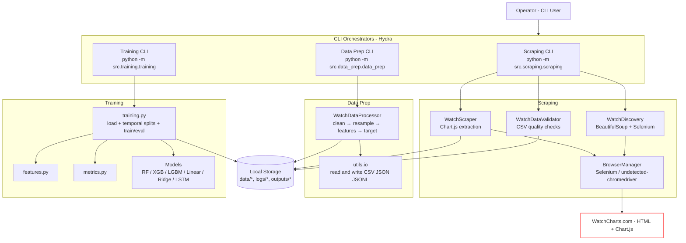

# Architecture Overview

This repo implements an end‑to‑end pipeline to discover, scrape, validate, prepare features, and train models on luxury watch price data from WatchCharts.com. It is organized into three domain modules driven by Hydra configs:

- Scraping: `src/scraping/` (entry: `python -m src.scraping.scraping`)
- Data Prep: `src/data_prep/` (entry: `python -m src.data_prep.data_prep`)
- Training: `src/training/` (entry: `python -m src.training.training`)
- Configs: `conf/*.yaml` (Hydra)
- Shared utilities: `src/utils/`

## Purpose & Boundaries
- Purpose: Collect historical price time series per watch, ensure quality, engineer features, and train forecasting/regression models.
- External boundary: WatchCharts.com (HTML pages with Chart.js data) via Selenium.
- Storage boundary: Local filesystem under `data/`, `logs/`, `outputs/`.
- Execution boundary: Local CLI entrypoints with Hydra overrides; no API server is included.

## Core Modules
- Orchestration (CLI + Hydra)
  - `src/scraping/scraping.py` — Orchestrates discovery → scraping → validation, prints summaries.
  - `src/data_prep/data_prep.py` — Runs cleaning + feature engineering, saves per‑watch files and summaries.
  - `src/training/training.py` — Loads unified/individual datasets, creates temporal splits, trains models, saves artifacts.
- Scrapers
  - `src/scraping/core/base_scraper.py` — `WatchScraper`: Chart.js data extraction, incremental CSV updates, retry/backoff, screenshot on failure.
  - `src/scraping/core/browser.py` — `BrowserManager`: Headless Chrome options, stealth/anti‑bot settings; Cloudflare detection & wait helpers.
  - `src/scraping/discovery.py` — `WatchDiscovery`: Brand page pagination parsing (BeautifulSoup), URL modeling, JSONL targets writing.
  - `src/scraping/validation.py` — `WatchDataValidator`: row‑count thresholds, date ordering checks, optional quarantine (kiv/), run summaries.
- Data Preparation
  - `src/data_prep/process.py` — `WatchDataProcessor`: load, clean (outliers/missing), resample to daily, feature engineering (lags, rolling, momentum, volatility, EMA/RSI/Bollinger, watch/brand/seasonality), target construction, metadata, output writing.
  - `src/data_prep/config.py` — Dataclass config schema (data/output/processing/features/watch/behavior/summary).
- Training
  - `src/training/features.py` — Feature selection/encoding for model consumption.
  - `src/training/metrics.py` — RMSE, MAE, R², MAPE, residual stats, directional accuracy.
  - `src/training/models/*` — Statistical (Linear/Ridge/Lasso, ARIMA/SARIMA), Tree‑based (RandomForest/XGBoost/LightGBM), Neural (LSTM).
- Utils & I/O
  - `src/utils/io.py` — CSV/JSON/JSONL helpers, `read_mixed_json_file`, safe write with backup, filename sanitization, directory helpers.

## C4‑Style Container Diagram (Mermaid)

## Primary Execution Paths
- CLI (single machine)
  - `python -m src.scraping.scraping [overrides...]`
  - `python -m src.data_prep.data_prep [overrides...]`
  - `python -m src.training.training [overrides...]`
- API: Not provided (out of scope for this repo).
- Scheduling: Not built‑in. Use cron/Airflow/Prefect to call the CLIs with Hydra overrides. Note Hydra changes CWD; prefer config‑driven/absolute paths.

## Notable Design Choices
- Hydra for configuration with simple, explicit YAMLs under `conf/`.
- Consolidated, concrete classes over deep inheritance trees.
- Selenium + stealth options and explicit Cloudflare detection/wait logic.
- Per‑watch processing and temporal splits to avoid leakage.
- Local FS artifacts by default; no DB dependency.

## Module Boundaries & Ownership
- Scraping owns network/browser automation and raw CSV integrity.
- Data Prep owns time‑series cleaning, feature engineering, and target creation.
- Training owns temporal evaluation, model training, metrics, and model I/O.
- Utils owns cross‑cutting I/O concerns.

---

# Component Map

For each component: responsibility, inputs/outputs, key symbols, config knobs, error handling, logging.

## Scrapers
- Responsibility: Navigate watch pages, extract Chart.js price points, update CSVs.
- Inputs: Watch targets (`brand`, `model_name`, `url`), Hydra `scraping.*`.
- Outputs: `data/watches/{Brand}-{ModelNumber}-{ModelName}.csv` with `date, price(SGD)`.
- Key: `WatchScraper.scrape_watches_batch`, `scrape_single_watch`, `extract_price_data`.
- Config: `scraping.delay_range`, `scraping.headless`, `scraping.max_retries`, `scraping.output_dir`, `scraping.brand_delay`.
- Errors: Retries on navigation; screenshot to `data/watches/error/*.png`; safe CSV write with backup.
- Logging: INFO progress; WARN/ERROR on failures; success counters.

## Parsers (Discovery)
- Responsibility: Parse brand listing pages, paginate, extract `/watch_model/...` links and metadata.
- Inputs: `brands` map, `discovery.target_count_per_brand`, `discovery.headless`.
- Outputs: `data/targets/watch_targets.jsonl` + per‑brand `data/targets/{Brand}.jsonl`.
- Key: `WatchDiscovery.discover_watches_from_brand_page`, `get_total_watch_count`, `save_*`.
- Config: `discovery.delay_range`, `discovery.headless`, `discovery.output_file`.
- Errors: Handles Cloudflare via `wait_for_cloudflare_challenge`; skips duplicates; continues on page timeouts.
- Logging: Page counts, unique path logs, summaries per brand.

## Storage / I/O
- Responsibility: Read/write CSV/JSON/JSONL, safe writes with backup, directory helpers, filename sanitization.
- Inputs: DataFrames/objects and target paths.
- Outputs: Files under `data/` and `logs/`.
- Key: `utils.io.safe_write_csv_with_backup`, `load_existing_csv_data`, `write_jsonl_file`, `read_mixed_json_file`.
- Config: Paths provided via Hydra sections.
- Errors: Backup/restore on failed CSV writes; warnings for invalid JSONL lines.
- Logging: Debug success messages, warnings on failures.

## Validation
- Responsibility: CSV row count, date ordering, and error classification; optional quarantine (kiv/).
- Inputs: `validation.data_dir`, `validation.min_rows`, `validation.move_invalid`.
- Outputs: Validation dict; logs under `logs/csv_validation_*/`; optional `kiv/` moves with `.info` metadata.
- Key: `WatchDataValidator.validate_all_files`, `validate_csv_file`, `get_invalid_watches_summary`.
- Config: `validation.*` keys.
- Errors: Graceful per‑file error capture; continues; summarises.
- Logging: File‑level OK/WARN/ERROR and aggregate stats.

## Feature Engineering
- Responsibility: Daily resampling, lags, rolling, momentum, volatility, EMA/RSI/Bollinger, watch/brand/seasonality features, target creation.
- Inputs: Per‑watch CSVs (`date`, `price(SGD)`), `data_prep.*` config.
- Outputs: Per‑watch processed CSVs and summary metadata.
- Key: `WatchDataProcessor._resample_to_daily_frequency`, `_add_*` feature methods, `_generate_watch_summary`.
- Config: `processing.frequency`, `processing.interpolation_method`, `processing.outlier_method`, `features.*`, `watch.*`.
- Errors: Optional continue‑on‑error, validation of minimum points.
- Logging: Verbose per‑watch status, counts, and summary.

## Datasets
- Responsibility: Persist per‑watch processed data and combined metadata.
- Inputs: Feature‑enriched DataFrames.
- Outputs: `data/processed/processed/{watch_id}.csv` (or direct under `data/processed`) and `data/processed/summary/watch_metadata.csv`.
- Key: `save_individual_watch_file`, `save_watch_summary`.
- Config: `output.save_individual`, `output.save_summary`, `output.file_format`.
- Errors: Safe write with backup; skip empty summaries.
- Logging: Paths created, counts written.

## Trainers
- Responsibility: Temporal splits per asset, model training across algorithms.
- Inputs: Unified CSV (`data/output/featured_data.csv`) or combined from `data/processed/*.csv`.
- Outputs: Models (`data/output/models/*.pkl`), `metrics_summary.json`.
- Key: `create_temporal_splits`, `train_model`, model classes.
- Config: `training.models`, `training.test_size`, `training.val_size`, model hyperparams under `models.*`.
- Errors: Per‑model try/except; warnings for assets with too few samples.
- Logging: Config dump, split sizes, per‑model metrics and success/failure.

## Evaluators
- Responsibility: Compute metrics and validate predictions.
- Inputs: `y_true`, `y_pred`.
- Outputs: Metrics dict with RMSE/MAE/R²/MAPE/residual stats/directional accuracy.
- Key: `calculate_metrics`, `validate_predictions`, `compare_models`.
- Config: N/A.
- Errors: MAPE guarded for zeros; NaN filtering.
- Logging: Metric summaries at INFO.

## Model I/O
- Responsibility: Serialize models, save/load metrics.
- Inputs: Trained model objects + metrics.
- Outputs: `data/output/models/*.pkl`, `metrics_summary.json`.
- Key: `save_results` in `training.py`.
- Config: `output.base_dir`, `output.save_models`.
- Errors: Warn on pickle failures.
- Logging: Saved paths for models/metrics.

## Orchestration
- Responsibility: End‑to‑end flow control and Hydra config management.
- Inputs: Hydra `conf/*.yaml` with CLI overrides.
- Outputs: Logs, artifacts per step.
- Key: CLIs in `scraping.py`, `data_prep.py`, `training.py`.
- Config: `pipeline.*` toggles; module‑specific sections.
- Errors: Top‑level try/except with clear summaries.
- Logging: Step banners, counts, and success rates.

---

# Operational Notes
- Dependencies
  - Core (pinned in `requirements.txt`): `hydra-core`, `omegaconf`, `pandas`, `selenium`, `webdriver_manager`, `beautifulsoup4`.
  - Training extras (install as needed): `scikit-learn`, `scipy`, `xgboost`, `lightgbm`, `statsmodels`, `tensorflow`.
- Environment
  - Python 3.10+. Hydra changes working dir; prefer config‑driven or absolute paths.
  - Headless mode configurable separately for discovery vs scraping.
- Scheduling
  - Use cron/Airflow/Prefect to invoke CLIs; pass Hydra overrides (e.g., `pipeline.run_validation=false`).
- Security
  - No secrets in repo. Respect rate limits; keep delays/headless realistic.
- CI/CD & Tests
  - Minimal tests present; recommend `pytest` under `tests/` mirroring `src/` with deterministic seeds and mocked I/O/browser.

---

# Training Pipeline

- Algorithms
  - Tree‑based: RandomForest, XGBoost (early stopping), LightGBM (early stopping)
  - Linear: LinearRegression, Ridge, Lasso
  - Neural: LSTM (Keras); Statistical models ARIMA/SARIMA available but not enabled by default
- Losses & Optimization
  - Regression losses via implementations; LSTM optimized with MSE (Adam)
  - Early stopping for XGB/LGBM; LSTM EarlyStopping callback
- Metrics
  - RMSE, MAE, R², optional MAPE, residual stats, directional accuracy (metrics logged and saved)
- Hyperparameters
  - Defaults in `conf/training.yaml` (estimators, depths, learning rates, leaves, alphas)
  - Override via Hydra CLI: `training.models=[...]`, `models.lightgbm.n_estimators=200`, etc.
- Temporal Splits & Reproducibility
  - Per‑asset time‑ordered splits: train (70%) → val (10%) → test (20%)
  - `training.random_state=42` for stochastic components; be mindful of library nondeterminism
- Experiment Tracking & Artifacts
  - Models pickled to `data/output/models/*.pkl`; metrics summary in JSON
  - No MLflow/W&B built‑in; can be added on top (see Quick Wins)
- Evaluation Protocol
  - Report metrics on held‑out test; compare multiple models; early stopping to limit overfit
  - Typical failure cases: too few samples per asset; feature NaNs if preprocessing misconfigured; target leakage if bypassing temporal split

---

# Risks, Debt, Trade‑offs

- Fragile scraping boundary
  - Cloudflare and dynamic content can break flows; relies on specific DOM/Chart.js.
  - Headless vs non‑headless behavior differs; UC availability is environment‑dependent.
- Tight coupling via filenames/IDs
  - Watch IDs inferred from URLs/filenames; inconsistent inputs can duplicate or misjoin.
- Partial dependency pinning
  - Training libs not pinned in `requirements.txt` → reproducibility drift.
- Performance & cost
  - Conservative delays and page waits slow throughput; LSTM adds heavy deps.
- Abstraction balance
  - Intentionally simple/concrete; some duplicated logic between discovery/scraping browser flows could be unified.

---

# Learning Notes

- Likely rationale
  - Favor clarity and operability over over‑engineering; consolidate legacy code into concrete classes.
  - Hydra makes experimentation easy without complex orchestration.
  - Local FS artifacts to avoid infra dependencies during iteration.
- If re‑writing greenfield
  - Use Playwright for more robust headless + anti‑bot handling; async batch orchestration.
  - Pydantic‑based configs; typed DTOs for targets/records; Marshmallow/Great Expectations for DQ.
  - Parquet datasets with schema registry; MLflow for experiment tracking.
  - Structured concurrency and robust backoff/rate‑limit controller.
- Questions for a future teammate
  1. Which pages/elements have broken scraping most often, and how were they stabilized?
  2. Any site‑specific anti‑bot patterns that required non‑obvious workarounds?
  3. How large is a typical full run (brands × watches × days) and runtime budget?
  4. What’s the policy when validation flags files (re‑scrape automatically or manual triage)?
  5. Which features mattered most to models in practice (importances)?
  6. Do we need a unified target definition beyond next‑day price (e.g., horizon‑specific targets)?
  7. How are failed scrapes tracked across runs to avoid repeated effort?
  8. Any constraints for headless vs visible Chrome on CI or servers?
  9. Should we consolidate discovery/scraping drivers and Cloudflare handling choices?
  10. What metrics thresholds define “good enough” for model promotion?
