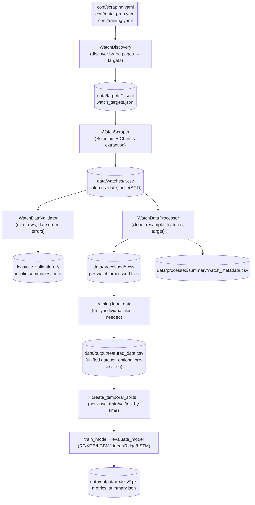

# Data Flow & Lineage

This document traces end‑to‑end lineage from discovery → raw HTML → extracted price series → validated CSVs → feature‑enriched datasets → temporal splits → model artifacts. All paths are configured via Hydra (`conf/*.yaml`).

## Pipeline DAG (Mermaid)

## Artifacts, Schemas, and Naming

- Targets (JSONL)
  - Path: `data/targets/watch_targets.jsonl` and `data/targets/{Brand}.jsonl`
  - Fields:
    - `brand: str`
    - `model_name: str` (cleaned label, may include "{id} - {name}")
    - `url: str` (absolute; `.../watch_model/{id}-{slug}/overview`)
    - `source: str` (e.g., "generated")
  - Producer: `WatchDiscovery.save_watch_targets` / `save_brand_watches`
  - Consumers: Scraper CLI; manual audits

- Raw Scraped CSVs
  - Path: `data/watches/{Brand}-{ModelNumber}-{ModelName}.csv`
  - Columns:
    - `date: str` (YYYY-MM-DD)
    - `price(SGD): float`
  - Producer: `WatchScraper.extract_price_data` + `safe_write_csv_with_backup`
  - Consumers: Validator, Data Prep

- Validation Logs
  - Paths: `logs/csv_validation_YYYYMMDD_HHMMSS/` and optional `data/watches/kiv/`
  - Contents: valid/invalid/error lists; `.info` files when moved to `kiv/`
  - Producer/Consumer: `WatchDataValidator`

- Processed Per‑Watch CSVs
  - Path: `data/processed/processed/{watch_id}.csv` (or directly under `data/processed` per config)
  - Required columns (leading):
    - `date: datetime or str`
    - `price(SGD): float`
    - `watch_id: str` (numeric watch id where parseable)
    - `brand: str`, `model: str`
  - Feature columns (examples):
    - Lags: `price_lag_{k}` (k ∈ `features.lag_periods`)
    - Rolling: `rolling_{stat}_{w}`, `price_position_{w}` (w ∈ `features.rolling_windows`)
    - Momentum: `price_change_{p}`, `price_change_abs_{p}` (p ∈ `features.price_change_periods`)
    - Volatility: `volatility_{w}` or custom windows
    - Technical: `ema_{w}`, `rsi`, `bollinger_upper_{w}`, `bollinger_lower_{w}` (if enabled)
    - Watch/brand: `tier_{entry|mid|high|ultra}`, `brand_tier_premium`, `is_sports_watch`, `is_dress_watch`
    - Temporal: `day_of_week`, `day_of_week_sin`, `month`, `month_sin`, `is_weekend`, etc.
    - Targets: `target`, `target_pct_change`
  - Producer: `WatchDataProcessor.process_single_watch`
  - Consumers: Training loader

- Unified Training Dataset (optional)
  - Path: `data/output/featured_data.csv`
  - Produced if not present by combining per‑watch processed CSVs.
  - Adds/normalizes: `asset_id` if not present; encodes categoricals later in `prepare_features`.

- Model Artifacts and Metrics
  - Paths: `data/output/models/{model}.pkl`, `data/output/models/metrics_summary.json`
  - Producer: `training.save_results`

## Partitioning & Naming Conventions
- Scraped data: `data/watches/Brand-ModelNumber-ModelName.csv` (sanitized: spaces/invalid chars replaced, long names truncated).
- Targets: `data/targets/WatchBrand.jsonl` and aggregate `watch_targets.jsonl`.
- Processed: `data/processed/processed/{watch_id}.csv` (configurable subdirs) + `data/processed/summary/watch_metadata.csv`.
- Training outputs: `data/output/featured_data.csv` (if unified), `data/output/models/*`.

## Data Quality Gates
- Scraping Validation (`src/scraping/validation.py`)
  - Min rows (default `validation.min_rows=100`).
  - Date ordering (ascending vs descending) heuristics.
  - Error file detection; per‑file details and session summaries.
- Data Prep Validation (`src/data_prep/process.py`)
  - Min data points per watch (default `processing.min_data_points=30`).
  - Outlier removal (`iqr`/`zscore`/`isolation_forest`).
  - Missing value handling (forward/backfill/linear/spline).
  - Daily resampling and feature NaN pruning for essential columns.

## Where Checks Occur
- Pre‑model: scrapers write CSVs, validator checks, data_prep cleans + features + targets, then training splits temporally per asset to prevent leakage.

